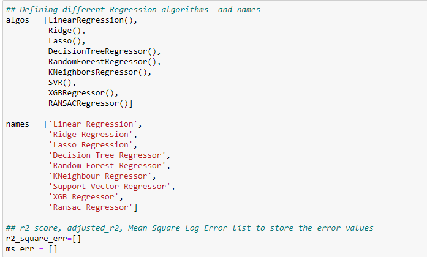
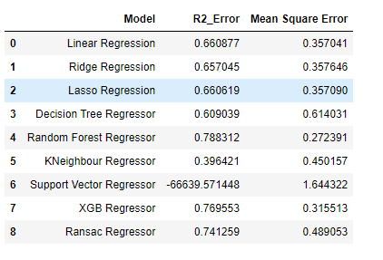
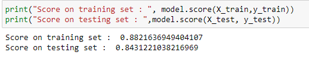

# Insurance_Premium_Prediction

#### Kaggle dataset [link](https://www.kaggle.com/faisalmoizhussain/insurance-premium-prediction/data).

#### The purposes of this exercise to look into different features to observe their relationship, and plot a multiple linear regression based on several features of individual such as age, physical/family condition and location against their existing medical expense to be used for predicting future medical expenses of individuals that help medical insurance to make decision on charging the premium.

#### The insurance.csv dataset contains 1338 observations (rows) and 7 features (columns). The dataset contains 4 numerical features (age, bmi, children and expenses) and 3 nominal features (sex, smoker and region).

Methods followed : 

### 1. Dataset loading and preprocessing of dataset: 
        * At the begining I loaded some important libraries for the preprocessing like pandas, matplotlib, seaborn etc.
        * Next checked the null values if present.
### 2. EDA
       * In this step i checked what are the colums present and their datatypes.
       * unique values present
       * converted the categorical features into numerical by using pandas get_dummies
### 3. Feature selection
       * here I converted the data using Standard Scaler
       * also separated the features and the labels
       * checked the multiclinearity conditions using statsmodels VIF.
       * also generated a correlation heatmap to see the corelations between the features.
### 4. Training
       * for training i separated the dataset using train test split.
       * introduced a pipeline using different regression models.
       

       * calculated the r2 score and mead square error score
       

       * based on the score I have selected the XGBoost Regressor model
       * using GridSearchCV i did the parameter tuning and again pass the training set to the XGBRegressor model

### 5. Predicting and saving the model
       * After getting the model I calculated the score based on train and test data
       * saved the model for future reference . 
 

